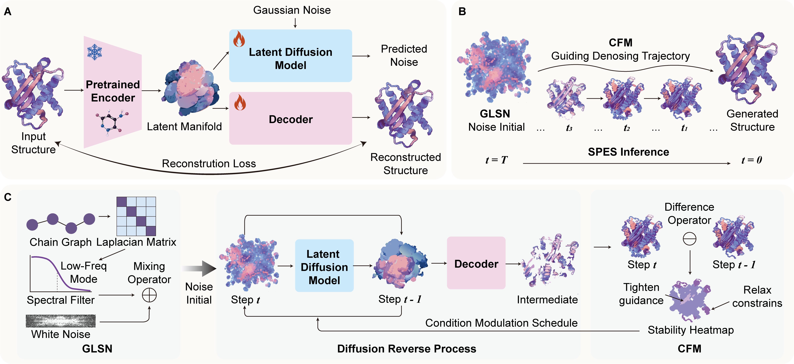

# PRIME: A Pretrained Representation–Induced Model for 3D Molecules in *De Novo* Binder Design



## :dna: Introduction

This is the official repository for our paper PRIME: A Pretrained Representation–Induced Model for 3D Molecules in *De Novo* Binder Design


## :mag: Quick Links

- [Setup](#rocket-setup)
  - [Environment](#environment)
  - [Trained Weights](#trained-weights)
- [Usage](#eyes-usage)
  - [Demo](#demo)
  - [Tutorials](#tutorials)
- [Reproduction of Paper Experiments](#page_facing_up-reproduction-of-paper-experiments)
  - [Additional Dependencies](#additional-dependencies)
  - [Datasets](#datasets)
  - [Training](#training)
  - [Inference & Configurations](#inference--configurations)
  - [Evaluation](#evaluation)
- [Contact](#bulb-contact)
- [Reference](#reference)

## :rocket: Setup

### Environment

We have prepared conda environment configurations for **cuda 11.7 + pytorch 1.13.1** (`env_cuda117.yaml`) and **cuda 12.1 + pytorch 2.1.2** (`env_cuda121.yaml`). For example, you can create the environment by:

```bash
conda env create -f env_cuda117.yaml
```

Remember to activate the environment before running the codes:

```bash
conda activate UniMoMo
```

### Trained Weights

The pretrained EPT checkpoint is available at: [Google Drive Link](https://drive.google.com/drive/folders/1ISCsnXss6YueYUvAIiR4wpm3k0TGjb44?usp=sharing).
Please download and place it at `ckpts/ept.ckpt`.


<!--## :eyes: Usage

### Demo

:bangbang: Before using the following codes, please first download the trained weights mentioned above.

**Peptide / Antibody CDR Design**

We have prepared cleaned codes for inferencing on single or multiple target proteins of interest, which are located under `./api`. An example is provided at `./api/demo` which designs peptide and antibody binders to KRas G12C on the same binding site. You can directly run the example by:

```bash
python -m api.generate --config api/demo/config.yaml --ckpt checkpoints/model.ckpt --save_dir api/demo/generations --gpu 0
```

Then you will get the generated results at `./api/demo/generations`.

**Nanobody Design**

We have also provided a demo for Nanobody design with the config `./api/demo/nanobody_config.yaml`. In this case, we use Alphafold 3 to cofold KRas G12C and a nanobody h-NbBCII10 (PDB ID: 3EAK) to get a pseudo complex structure. The Alphafold 3 tends to memorize common binding sites on target proteins and docking orientations for nanobodies/antibodies, thus will produce seemingly reasonable complexes, which is enough as we only need the docked framework for CDR design. It is then renumber with Chothia system to get the input file `./api/demo/7mdp_3eak_chothia.pdb`. The antibody template is naturally compatible with nanobodies, therefore we can directly treat it as an antibody with only the heavy chain in the configuration and run:

```bash
python -m api.generate --config api/demo/nanobody_config.yaml --ckpt checkpoints/model.ckpt --save_dir api/demo/nanobody_generations --gpu 0
```


 ### Tutorials

Here we illustrate how we assembled the demo case, so that the users can customize configurations to run designs on their target of interest.

1. **Reference Binder.** Find a complex on PDB with a reference binder. Here we locate [**7mdp**](https://www.rcsb.org/structure/7MDP), which includes an antibody inhibitor to KRas G12C. This reference antibody helps the program to identify on which binding site the model should design binders.

2. **(Optional) Antibody Renumbering.** If you want to design antibodies, currently UniMoMo only supports designing CDRs on the antibody framework docked on the target proteins. The program relies on the Chothia numbering system to identify which parts on the antibody are CDRs, so the residue IDs in the given PDB file should be renumbered according to Chothia system. We have provided the toolkit in `./api/renumber.py`. With running the following command, the renumbered PDB file will be saved at `./api/demo/7mdp_chothia.pdb`:
   
   ```bash
   cd api
   python renumber.py demo/7mdp.pdb demo/7mdp_chothia.pdb chothia
   ```

3. **Configure.** Write a config clarifying the chain IDs of the target protein and the ligand, as well as the types and the numbers of binders to generate. Here we demonstrate the meaning of the config at `./api/demo/config.yaml`:
   
   ```yaml
   # contents of ./api/demo/config.yaml
   dataset:
     # Multiple references can be provided. You just need to add the corresponding information in a new line under each of pdb_paths, tgt_chains, and lig_chains.
     pdb_paths:
       - ./api/demo/7mdp_chothia.pdb   # Path to the reference complex.
     tgt_chains:
       - A     # The target proteins only include one chain, that is A.
     lig_chains:
       - HI    # The reference binder includes two chains, that is H and I. With antibody provided, the program assumes the heavy chain goes before the light chain, which means it will regard H as the heavy chain and I as the light chain in this case.
   
   templates:
     # Here we specify the type of binders we want to design
     - class: LinearPeptide    # Linear peptides with at lengths between 10 to 12, left inclusive and right exclusive.
       size_min: 10
       size_max: 12
     - class: Antibody     # Design HCDR3 on the given antigen-antibody complex. If multiple CDRs need to be designed, it is suggested to run designs sequentially, with one CDR designed each time.
       cdr_type: HCDR3
     - class: Molecule     # Small molecules. By default the number of blocks is sampled according to the spatial size of the binding site. You can also specify "size_min" and/or "size_max" to control the threshold of the sampled number of blocks.
   
   batch_size: 8   # Batch size. Adjust it according to your GPU memory available. Batch size = 8 can be run under 12G memory for most cases.
   n_samples: 20  # Number of generations. On each target provided, the model will generate 20 candidates for each template.
   ```

4. **Generation.** Finally, you can use the config to generate results via the following command, where `--config`, `--ckpt`, `--save_dir`, and `--gpu` specify the configuration, the checkpoint, the output directory, and the GPU to use, respectively:
   
   ```bash
   python -m api.generate --config api/demo/config.yaml --ckpt checkpoints/model.ckpt --save_dir api/demo/generations --gpu 0
   ``` -->

## :page_facing_up: Reproduction of Paper Experiments

### Additional Dependencies

#### PyRosetta

PyRosetta is used to calculate interface energy of generated peptides and antibody CDRs. Please follow the official instruction [here](https://www.pyrosetta.org/downloads) to install it.


### Datasets

**Throughout the instructions, we suppose all the datasets are downloaded below `./datasets`.**

#### 1. Peptide

Suppose all data are saved under `./datasets/peptide`. We set environment variable `export PREFIX=./datasets/peptide`. The data for peptides includes the following datasets:

- LNR: The test set of 93 complexes.
- PepBench: The training/validation dataset of about 6K complexes with the peptide length between 4 to 25.
- ProtFrag: Augmented dataset with about 70K pseudo pocket-peptide complexes from local contexts of protein monomers.

Download:

```bash
# create the folder
mkdir -p $PREFIX
# LNR
wget https://zenodo.org/records/13373108/files/LNR.tar.gz?download=1 -O ${PREFIX}/LNR.tar.gz
tar zxvf ${PREFIX}/LNR.tar.gz -C $PREFIX
# PepBench
wget https://zenodo.org/records/13373108/files/train_valid.tar.gz?download=1 -O ${PREFIX}/pepbench.tar.gz
tar zxvf $PREFIX/pepbench.tar.gz -C $PREFIX
mv ${PREFIX}/train_valid ${PREFIX}/pepbench
# ProtFrag
wget https://zenodo.org/records/13373108/files/ProtFrag.tar.gz?download=1 -O ${PREFIX}/ProtFrag.tar.gz
tar zxvf $PREFIX/ProtFrag.tar.gz -C $PREFIX
```

Processing:

```bash
python -m scripts.data_process.peptide.pepbench --index ${PREFIX}/LNR/test.txt --out_dir ${PREFIX}/LNR/processed --remove_het
python -m scripts.data_process.peptide.pepbench --index ${PREFIX}/pepbench/all.txt --out_dir ${PREFIX}/pepbench/processed
python -m scripts.data_process.peptide.transform_index --train_index ${PREFIX}/pepbench/train.txt --valid_index ${PREFIX}/pepbench/valid.txt --all_index_for_non_standard ${PREFIX}/pepbench/all.txt --processed_dir ${PREFIX}/pepbench/processed/
python -m scripts.data_process.peptide.pepbench --index ${PREFIX}/ProtFrag/all.txt --out_dir ${PREFIX}/ProtFrag/processed
```

#### 2. Antibody

Suppose all data are saved under `./datasets/antibody`. We set environment variable `export PREFIX=./datasets/antibody`. We use SAbDab downloaded at **Sep 24th, 2024** for training, validation, and testing on antibody CDR design, with testing complexes coming from RAbD. As the database is weekly updated, we have also uploaded the processed binary files and index files on [google drive](https://drive.google.com/file/d/1N5Y46B0CBDQ4fOxkiMCuyPz3yPdDYVG-/view?usp=sharing) for reproduction and benchmarking purposes. We also provide the IDs of the complexes used in our paper under `./datasets/antibody`(train/valid/test_id.txt), so that users can use these IDs to filter the downloaded SAbDab database to reconstruct the splits used in our paper.

Download with the newest updates:

```bash
mkdir -p ${PREFIX}/SAbDab
# download the summary file
wget https://opig.stats.ox.ac.uk/webapps/sabdab-sabpred/sabdab/summary/all/ -O ${PREFIX}/SAbDab/summary.csv
# download the structure data
wget https://opig.stats.ox.ac.uk/webapps/newsabdab/sabdab/archive/all/ -O ${PREFIX}/SAbDab/all_structures.zip
# decompress the zip file
unzip $PREFIX/SAbDab/all_structures.zip -d $PREFIX/SAbDab/
```

Processing:

```bash
# process
python -m scripts.data_process.antibody.sabdab --index ${PREFIX}/SAbDab/summary.csv --out_dir ${PREFIX}/SAbDab/processed
# split by target protein sequence identity (40%)
# if you want to reconstruct the benchmark used in our paper, please manually generate the index files with the splits provided under ./datasets/antibody 
python -m scripts.data_process.antibody.split --index ${PREFIX}/SAbDab/processed/index.txt --rabd_summary ${PREFIX}/RAbD/rabd_summary.jsonl
```


### Training

PRIME is trained in two stages:
1. **Pretrained Representation Learning**: Training the Decoder using the EPT encoder.
2. **Latent Diffusion Model (LDM)**: Training the diffusion model on the frozen latent representations.

Our training based on 4 4090 GPUs, you can change the number of GPUs by modifying the `GPU` variable.

```bash
# Antibody
GPU=1,2,3,4 bash scripts/train.sh ./configs/IterAE/train_ab.yaml
GPU=1,2,3,4 bash scripts/train.sh ./configs/LDM/train_ab.yaml  

# Peptide
GPU=1,2,3,4 bash scripts/train.sh ./configs/IterAE/train_pep.yaml
GPU=1,2,3,4 bash scripts/train.sh ./configs/LDM/train_pep.yaml  
```

**Training Configurations:**

*   **AutoEncoder (`./configs/IterAE/train.yaml`)**:
    *   `training_mode`: set to `pretrain`
*   **LDM (`./configs/LDM/train.yaml`)**:

### Inference & Configurations

The following commands generate 100 candidates for each target in the test sets.

```bash
# peptide
python generate.py --config configs/test/test_pep.yaml --ckpt /path/to/checkpoint.ckpt --gpu 0 --save_dir ./results/pep
# antibody
python generate.py --config configs/test/test_ab.yaml --ckpt /path/to/checkpoint.ckpt --gpu 0 --save_dir ./results/ab

```

**Sampling Configuration (SPES):**

To enable **Semantics-Preserving Exploratory Sampling (SPES)**, use the following `sample_opt` settings in your inference config (e.g., `configs/test/test_pep.yaml`):

```yaml
sample_opt:
  noise_beta: 1
  use_graph_laplacian: true  # Use Graph Laplacian 
  use_mc_cads: true
  mc_cads_tau_scaf: [0.3, 0.6]   # Generation area
  mc_cads_tau_back: [0.4, 0.5]   # Condition area
  mc_cads_noise_scale: 0.1
  mc_cads_rescale: true          # Rescale corrupted condition to original mean/std
  mc_cads_mixing_factor: 0.5
```

### Evaluation

:question: Due to the non-deterministic behavior of `torch.scatter`, the reproduced results might not be exactly the same as those reported in the paper, but should be very close to them.

The evaluation scripts are as follows. Note that the evaluation process is CPU-intensive. During our experiments, each of them requires running for 3-4 hours on 32 cpu cores.

```bash
# peptide
python -m scripts.metrics.peptide_o_ray --results ./results/pep/results.jsonl --num_workers 96 --calc_dg
# antibody
python -m scripts.metrics.peptide_o_ray --results ./results/ab/results.jsonl --antibody --log_suffix HCDR3 --num_workers 64 --calc_dg

```

## :bulb: Contact

Thank you for your interest in our work!

Please feel free to ask about any questions about the algorithms, codes, as well as problems encountered in running them so that we can make it clearer and better. You can either create an issue in the github repo or contact us at [here](mailto:zhihuatean@gmail.com).

## Acknowledgments

Our repository is adopted from [UniMoMo](https://github.com/kxz18/UniMoMo). We thank the authors for their open-source contribution.